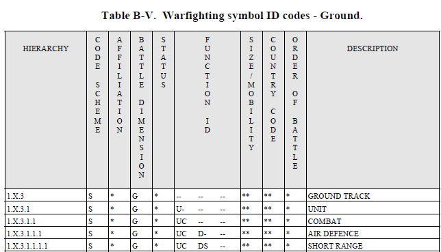
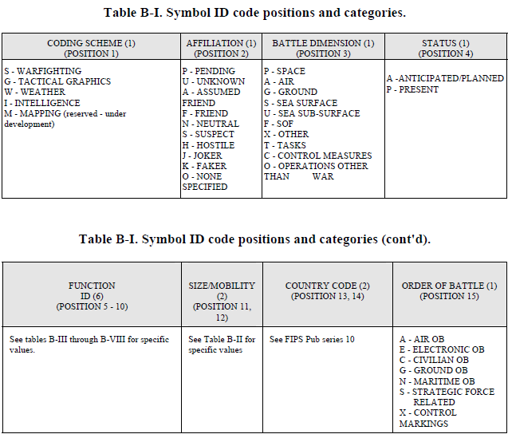

### Structure code APP6

**Symbol ID code.**
 A symbol identification (ID) code is a 15-character
alphanumeric identifier that provides the information necessary to display a symbol
or graphic. Characters need not be present in all 15 positions of a code. Table B-I
identifies the 9 categories of information included in a symbol ID code and the
position each occupies in the 15-character identifier.

a) **Code scheme, position 1.** This position indicates  the overall symbology set to which a symbol belongs.

b) **Affiliation, battle dimension, and status, 2, 3, and 4.** These positions
determine the frame shape of a symbol and indicate its actual or planned
location.
c) **Function ID, positions 5 through 10.** These positions identify a symbol’s function, with each position providing increasing levels of detail and
specialization. The specific values for these positions are included with the symbol ID codes in Tables B-III through B-X.

d) **Size/mobility indicator code, positions 11 and 12.** These positions identify 
the size and mobility of a symbol. Table B-II contains the specific code values used in these positions.

e) **Country code, positions 13 and 14.** These positions identify the country
with which a symbol is associated. Country code identifiers are listed in
Federal Information Processing Standard (FIPS) Pub 10 series.

f) **Order of battle, position 15.** This position provides additional information
about the role of a symbol in the battlespace. For example, a bomber that
has nuclear weapons on board may be strategic force-related, or a tactical
graphic may also perform the role of a control point.

g) **Symbol ID code tables.** Tables B-III through B-VIII list the codes for
space, air, ground, sea surface, sea subsurface, and special operations
symbols, respectively. Tables B-IX and B-X list the codes for tactical and
weather graphics. In each table, an alphanumeric character indicates the
known value for that position for a given symbol. An asterisk (*) indicates
a position that is defined by the user based on specific symbol
circumstances. A dash (-) indicates that no information is provided in the
position.

### Liens utiles

- [milsymbol-APP6b](../APP6-C/extractor/rawdata/Milsymbol%20APP6-B.html)
- [JOINT SYMBOLOGY APP-6(B)](utils/APP-06%28B%29%20Joint%20Symbology.pdf)